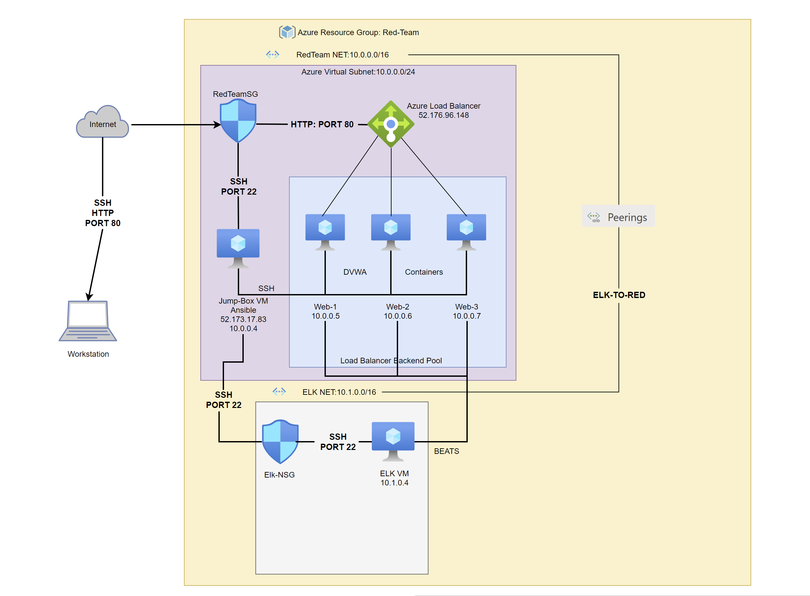
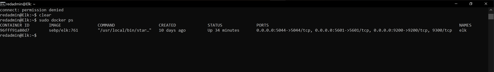

## Automated ELK Stack Deployment

The files in this repository were used to configure the network depicted below.

The Ansible Playbook files have been tested and used to generate a live ELK deployment on Azure. They can be used to either recreate the entire deployment pictured above. Alternatively, running specific Playbook file may be used to install only certain pieces of it, such as Filebeat or Metricbeat.

  - _https://github.com/waitsneaky/Elk-Stack-Project/tree/main/AnsiblePlaybooks._ TODO: Add pentest.yml + Elm.yml File here too

This document contains the following details:
- Description of the Topologu
- Access Policies
- ELK Configuration
  - Beats in Use
  - Machines Being Monitored
- How to Use the Ansible Build

### Description of the Topology

The main purpose of this network is to expose a load-balanced and monitored instance of DVWA, the D*mn Vulnerable Web Application.

Load balancing ensures that the application will be highly responsive, in addition to restricting __traffic__ to the network.
- The Load Blancer in this Elk Server is stationed more on Layer 4 of the OSI model. We are using the load balancer more as a transporting level for our Web VMs.
- Jump Box was implemented on this server for an easy single point of traffic to our VMs. Along with that, we can get better auditing logs for administrative tasks through the Jump Box. 

Integrating an ELK server allows users to easily monitor the vulnerable VMs for changes to the _____ and system logs.
- Filebeat will take logs from the Web VMs and move them all to a central location for easy log management.
- TODO: Add filebeat.reference.yml in project
- Metricbeat puts out metric information about our system metrics. 
- TODO: Add metricbeat.reference.yml in project

The configuration details of each machine may be found below.
_Note: Use the [Markdown Table Generator](http://www.tablesgenerator.com/markdown_tables) to add/remove values from the table_.

| Name     | Function | IP Address | Operating System |
|----------|----------|------------|------------------|
| Jump Box | Gateway  | 10.0.0.4   | Linux            |
| Web-1    | VM       | 10.0.0.5   | Linux            |
| Web-2    | VM       | 10.0.0.6   | Linux            |
| Web-3    | VM       | 10.0.0.7   | Linux            |

### Access Policies

The machines on the internal network are not exposed to the public Internet. 

Only the public machine can accept connections from the Internet. Access to this machine is only allowed from the following IP addresses:
- 10.0.0.5 (Web-1)
- 10.0.0.6 (Web-2)
- 10.0.0.7 (Web-3)

Machines within the network can only be accessed by Jump Box Machine.
- Elk VM can only be accessed by Jump Box (10.0.0.4)

A summary of the access policies in place can be found in the table below.

| Name     | Publicly Accessible | Allowed IP Addresses |
|----------|---------------------|----------------------|
| Jump Box | NO                  | 10.0.0.5 + 10.0.0.6 + 10.0.0.7 + 10.1.0.4    |
|          |                     |                      |
|          |                     |                      |

### Elk Configuration

Ansible was used to automate configuration of the ELK machine. No configuration was performed manually, which is advantageous because...
- Every computer can mirror from your ansible configuration. No need to worry that one system may be missing an application which was needed on it.
- Saves time. Instead of installing items onto each system manaully, Ansible automates the process for you.

The Elk Playbook implements the following tasks:
- Installs docker.io
- Install pip3
- Installs docker python module
- Allocates more Memory for the ELK server
- Downloads and launches a docker elk container on three published ports

The following screenshot displays the result of running `docker ps` after successfully configuring the ELK instance.

### Target Machines & Beats
This ELK server is configured to monitor the following machines:
- 10.0.0.5 (Web-1)
- 10.0.0.6 (Web-2)
- 10.0.0.7 (Web-3)

We have installed the following Beats on these machines:
- filebeat
- metricbeat

These Beats allow us to collect the following information from each machine:
- Filebeat:
- Metricbeat:

### Using the Playbook
In order to use the playbook, you will need to have an Ansible control node already configured. Assuming you have such a control node provisioned: 

SSH into the control node and follow the steps below:
- Copy the file(s) filebeat-playbook.yml; metricbeat-playbook.yml; to /etc/ansible/.
- Update the _____ file to include...
- Run the playbook ansible-playbook {playbook yml name}, and navigate to {elk VM public key}:5601/app/kabana to check that the installation worked as expected.

_TODO: Answer the following questions to fill in the blanks:_
- _Which file do you update to make Ansible run the playbook on a specific machine? How do I specify which machine to install the ELK server on versus which to install Filebeat on?_

_As a **Bonus**, provide the specific commands the user will need to run to download the playbook, update the files, etc._
